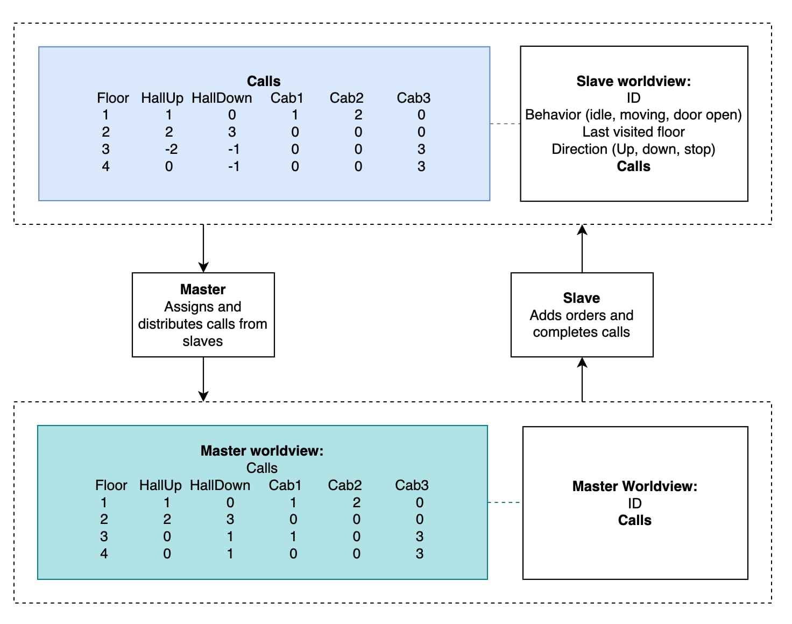
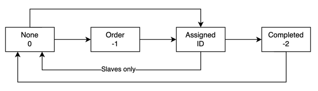

# TTK4145 Elevator Project at NTNU, Spring 2026, Group 45

## Group Members
* Henrik Markestad
* Joachim Frydenlund
* Kritagya Panthi

## Project Description
In this project we have created real-time software for controlling `n` elevators across `m` floors. The system is designed with fault tolerance in mind, where redundancy features play an essential role. The system is implimented with a Master-Slave topology using UDP communication.

## How to Run

The code is run by first running the elevatorserver on one terminal:

```sh
# Teminal 1
elevatorserver --port [hardware-port]
```

Then navigating to `./ttk4145-project/cmd/elevator` and running the main file on another terminal:

```sh
# Terminal 2
go run ./main.go -network-id [network-id] -hardware-port [hardware-port]
```

`-network-id` is a required command line argument, while the rest have default values. For more detailed usage, like how to add more floors and elevators to the system, see:

```sh 
go run ./main.go -help
```

## System Requirements
* Once a button light is turned on, it is a service guarante.
* Even in failiure states (network loss, power loss, system crash, etc.) no calls are lost.
* The lights, buttons and doors function as expected.
* If an elevator is disconnected from the rest of the system, it functions as a single-elevator and still completes and takes new calls.

## System Design Choices
The system is designed such that the master and slaves periodically communicate using their respective worldviews, where the master is also its own slave. The diagram below demonstrates this communication.



As shown, the worldviews consist of a calls matrix, which records the the type of call on each floor of an elevator. Notice there are three types of calls: HallUp, HallDown and Cab. Hall calls are the calls made for the elevator from the outside, while cab calls are from the inside. The digram below shows what status each call can have, and the permitted transition between the statuses.



When a call is made, the status of the call changes in that slave’s calls matrix from None to Order. The master receives this worldview from the slave, and if the call is marked as None in its matrix, it updates the status to Assigned. Who it is assigned to is known by marking the call with the ID of that node. If it is a cab call, the master assigns it to the slave it came from. When the slaves receive this updated worldview from the master, the slaves update the status of the call to Assigned as well, if the call was marked None or Order. All slaves then turn on the light for that call when the status changes, but for cab calls, only the slave the call was assigned to turns the light on. When the assigned slave has carried out the call, it changes the call status from Assigned to Completed. The master receives this updated worldview from the slave, and if the call is marked as Assigned for the master, it also updates the status to None. When the slaves receives this updated worldview, and the call is marked as Assigned or Completed, the status of the call is changed to None. The lights for that call then turn off.
